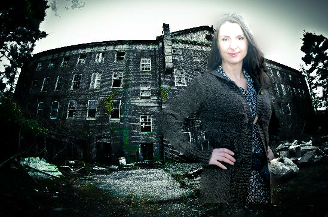
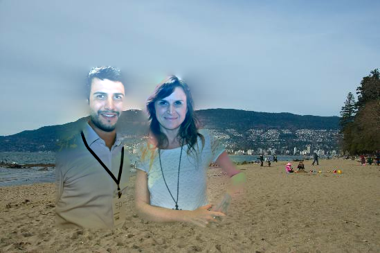
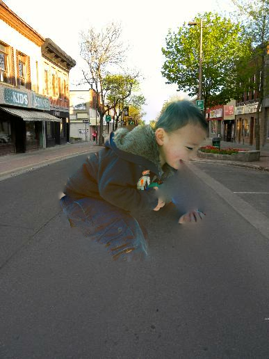

# Person Image Augmentation Using YOLOv8, SAMv2, and OpenCV

## **Overview**
This README provides a pipeline for augmenting the Wake Vision dataset by blending extracted persons into new backgrounds. It consists of three main steps:
1. **Detect persons using YOLOv8** to get bounding boxes.
2. **Segment the detected persons using SAM**.
3. **Blend segmented persons into new backgrounds**.

By using **Poisson Image Editing**, the inserted persons blend naturally into different scenes, increasing dataset diversity for training the model.

---

## **1. Detecting Persons with YOLOv8**
**YOLOv8** (You Only Look Once) is a state-of-the-art object detection model that efficiently detects persons in images.

### **Setup YOLOv8**
1. Install YOLOv8:
   ```bash
   pip install ultralytics opencv-python torch torchvision
   ```
2. Run YOLOv8 to detect persons:
   ```python
    # Run YOLOv8 to detect persons
    yolo_model = YOLO("yolov8n.pt")  # Small model for fast inference
    yolo_results = yolo_model(image)[0]
    
    person_boxes = []
    for result in yolo_results.boxes.data:
        x1, y1, x2, y2, conf, cls = result.cpu().numpy()
        if int(cls) == 0:  # Class 0 = Person
            
            # # check confidence
            if conf < 0.9:
                print(f"Person detected with low confidence {conf}.")
                return None, None
            
            person_boxes.append([int(x1), int(y1), int(x2), int(y2)])

    if not person_boxes:
        print("No persons detected.")
        return np.zeros_like(image[:, :, 0]), image  # Empty mask

   ```

---

## **2. Segmenting Persons with SAM**
**Segment Anything Model** is used to segment the detected persons precisely.

### **Setup SAMv2**
1. Install SAM:
   ```bash
   pip install git+https://github.com/facebookresearch/segment-anything.git
   ```
2. Download the SAM model checkpoint:
   ```bash
   wget https://dl.fbaipublicfiles.com/segment_anything/sam_vit_b_01ec64.pth -O sam_vit_b.pth
   ```

### **Segmenting Persons**
```python
    model_type = "vit_b"
    sam_checkpoint = "sam_vit_b.pth"  # Ensure this file is downloaded

    sam = sam_model_registry[model_type](checkpoint=sam_checkpoint).to("cuda")
    predictor = SamPredictor(sam)

        predictor.set_image(image)

    # Generate masks for all detected persons
    masks = []
    for box in person_boxes:
        mask, _, _ = predictor.predict(box=np.array(box), multimask_output=False)
        masks.append(mask[0])

    # Merge all person masks
    if masks:
        person_mask = np.any(masks, axis=0).astype(np.uint8) * 255
    else:
        person_mask = np.zeros_like(image[:, :, 0])  # Empty mask

    return person_mask, image

```

---

## **3. Blending with OpenCV’s `seamlessClone`**
### **What is `seamlessClone`?**
`cv2.seamlessClone` implements **Poisson Image Editing**, allowing the seamless insertion of an object (person) into another image (background). It preserves the gradient flow to make the inserted object look naturally integrated.

### **Blending Persons into Backgrounds**
```python
def blend_person_with_background(person, mask, background):
    # Resize person to fit background
    h_bg, w_bg, _ = background.shape
    h_p, w_p, _ = person.shape

    scale_factor = random.uniform(0.6, 0.8)  # Random scaling
    # scale_factor = 0.9
    new_w, new_h = int(w_p * scale_factor), int(h_p * scale_factor)

    person_resized = cv2.resize(person, (new_w, new_h), interpolation=cv2.INTER_LINEAR)
    mask_resized = cv2.resize(mask, (new_w, new_h), interpolation=cv2.INTER_LINEAR)

    # Random position on background
    x_offset = random.randint(0, w_bg - new_w)
    y_offset = random.randint(0, h_bg - new_h)
    center = (x_offset + new_w // 2, y_offset + new_h // 2)

    # Apply Poisson seamless cloning
    blended = cv2.seamlessClone(person_resized, background, mask_resized, center, cv2.NORMAL_CLONE)

    return blended
```

---

## Examples



